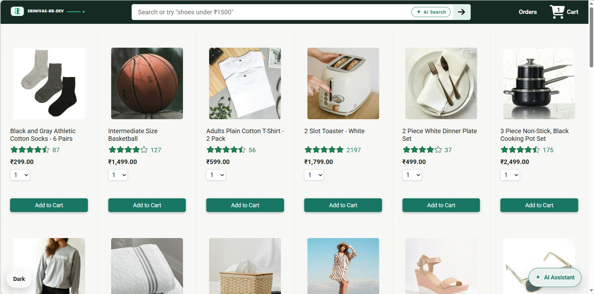
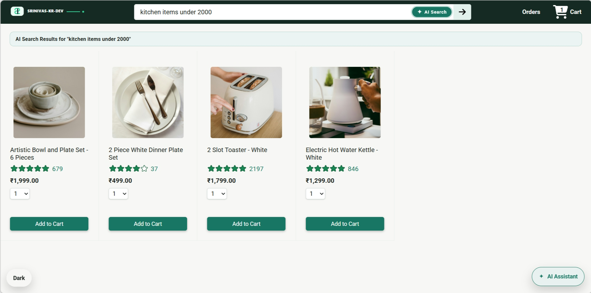
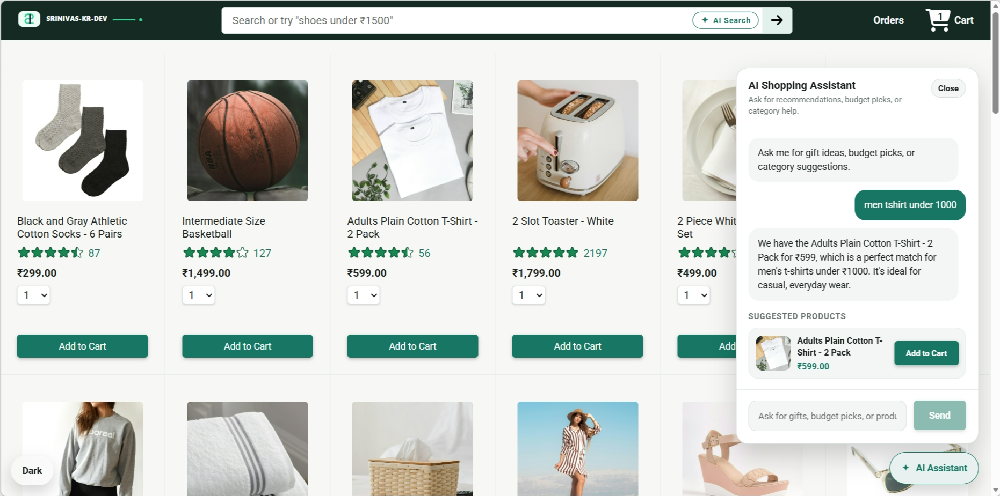
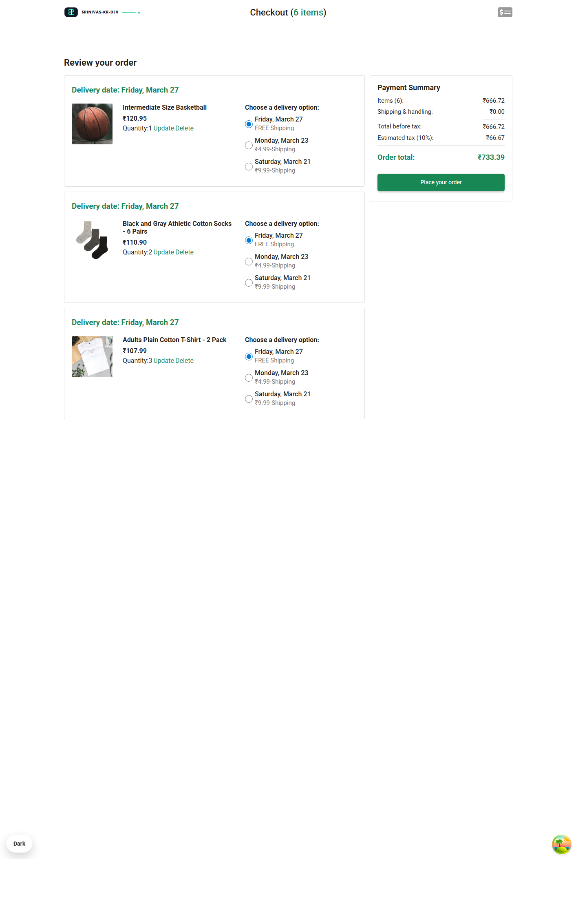
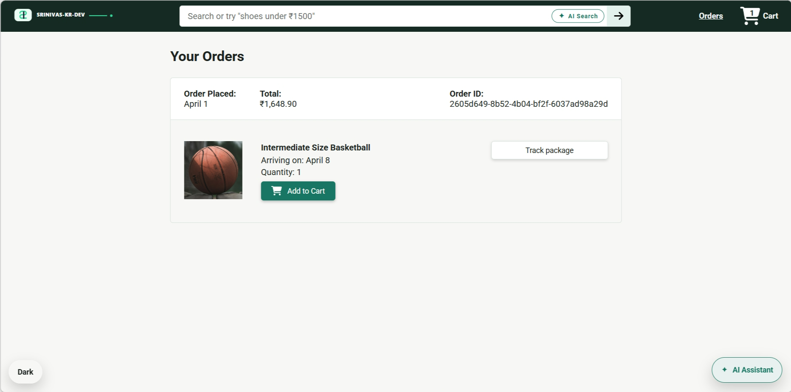
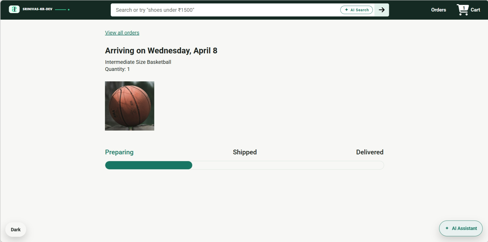

# React E-Commerce Application

Modern e-commerce web application built with React and TypeScript.

This project includes a complete shopping flow with product browsing, cart management, checkout, order history, package tracking, AI-powered product discovery, and an AI shopping assistant backed by the companion Express + MongoDB API.

This is an ongoing project, and I plan to continue improving features, UI polish, testing coverage, and overall developer experience over time.

## Features

- Product listing with search
- AI Search for natural-language product discovery
- AI Shopping Assistant for catalog-grounded recommendations
- Add to cart with quantity selection
- Shopping cart updates and item removal
- Delivery option selection
- Payment summary, INR price display, and order placement
- Orders history page
- Package tracking page
- Dark and light theme support
- Responsive desktop and mobile layout
- API integration with Axios
- Server-state caching and mutation handling with TanStack Query

## Tech Stack

### Frontend


### Testing


## Screenshots

The screenshots below show the current UI and main user flows.

### Home



### AI Search Results



### AI Shopping Assistant



### Checkout



### Orders



### Tracking



### Not Found


## Installation

```bash
git clone https://github.com/Srinivas-KR-Dev/react-ecommerce-typescript
cd react-ecommerce-typescript
npm install
```

## Local Development

### Prerequisites

- Node.js 18+
- npm
- Ecommerce API running on `http://localhost:7000`
- Backend repo cloned at the same directory level as this repo

### API Setup

The frontend uses relative `/api` and `/images` paths in the codebase.

During local development, Vite proxies those requests to:

- `http://localhost:7000/api`
- `http://localhost:7000/images`

For the current setup, you only need the backend running on port `7000`.

### Start the app

```bash
npm run dev
```

### Build for production

```bash
npm run build
```

Important:

- `npm run build` outputs directly into `../ecomm-backend-MongoDB/dist`
- this project is intentionally configured to work with the backend repo living alongside this repo
- if you clone only this frontend repo, update `build.outDir` in `vite.config.ts` before using the production build output

### Preview production build

```bash
npm run preview
```

## Testing

```bash
npx vitest run
```

```bash
npx vitest
```

```bash
npm run lint
```

Current automated coverage includes core flows for:

- product interactions
- checkout and payment summary
- orders and order details
- tracking loading state
- header search and AI Search
- AI Shopping Assistant
- money formatting

## Project Structure

```text
src/
  components/   Shared UI components (Header, AiAssistantChat, ErrorBoundary)
  context/      React context for theme management
  hooks/        TanStack Query hooks for API calls and mutations
  pages/        Route-level page components
  types/        Shared TypeScript interfaces and models
  utils/        Money formatting and query client setup
```

## Main Routes

- `/`
- `/checkout`
- `/orders`
- `/tracking/:orderId/:productId`

## Notes

- Theme preference is stored locally.
- AI Search and the AI Shopping Assistant are grounded on catalog data from the backend.
- Built a lightweight RAG-style shopping assistant that retrieves relevant products from the catalog and grounds Gemini responses in that product context.
- Server state is managed with React Query.
- `npm run build` outputs directly into the backend's `dist/` folder (`../ecomm-backend-MongoDB/dist`), where Express serves it as static files on the same origin, so `/api` and `/images` routes resolve automatically with no CORS configuration needed.

## Live Demo

https://srinivaskr.live

Deployed using AWS Elastic Beanstalk, with MongoDB Atlas Cloud as the database and SSL certificate enabled for secure access.

## Author

Srinivas-KR-DEV
